          
I'll help format your README.md to make it more organized and beautiful, including the data source information:

# Titanic - Machine Learning from Disaster 🚢

## Overview 📊
This project implements a machine learning solution for the famous [Kaggle Titanic competition](https://www.kaggle.com/competitions/titanic/data), predicting passenger survival on the Titanic. The project follows MLOps best practices using DVC (Data Version Control) for experiment tracking and model versioning.

## Data Source 📁
The dataset is sourced from the official Kaggle competition: [Titanic - Machine Learning from Disaster](https://www.kaggle.com/competitions/titanic/data)

### Dataset Description
- **Training Set**: 891 passengers
- **Test Set**: 418 passengers
- **Features**: Includes passenger information like class, name, sex, age, siblings/spouses aboard, parents/children aboard, ticket number, fare, cabin number, and port of embarkation

## Project Structure 🗂️
```plaintext
├── data/                  # Data files (managed by DVC)
├── dvclive/              # Experiment tracking metrics
├── experiments/          # Experiment results
├── models/               # Trained model files
├── src/                  # Source code
    ├── data_ingestion.py       # Kaggle data download
    ├── data_preprocessing.py   # Data cleaning and imputation
    ├── feature_engineering.py  # Feature creation and transformation
    ├── model_training.py       # Model training implementation
    └── model_evaluation.py     # Model evaluation and metrics
```

## 🔧 Data Preprocessing Pipeline

### Missing Value Treatment
| Feature  | Strategy |
|----------|----------|
| Age      | Median by Title & Pclass |
| Cabin    | Binary feature + Deck extraction |
| Embarked | Most frequent value ('S') |
| Fare     | Median by Pclass |

## 🔄 DVC Pipeline Stages



```mermaid
graph LR
    A[Data Ingestion] -->|train.csv\ntest.csv| B[Data Preprocessing]
    B -->|processed_data.csv| C[Feature Engineering]
    C -->|engineered_features.csv| D[Model Training]
    D -->|trained_models| E[Model Evaluation]
    E -->|metrics.json\nplots| F[DVCLive Tracking]

    style A fill:#93c47d
    style B fill:#6fa8dc
    style C fill:#8e7cc3
    style D fill:#c27ba0
    style E fill:#f6b26b
    style F fill:#ffd966
```

### Stage Details:

1. **Data Ingestion** 📥
   - Downloads data from Kaggle API
   - Outputs: train.csv, test.csv

2. **Data Preprocessing** 🧹
   - Handles missing values:
     - Age: Imputed by Title & Pclass
     - Embarked: Most frequent ('S')
     - Fare: Median by Pclass

3. **Feature Engineering** ⚙️
   - Creates derived features
   - Performs encoding
   - Outputs engineered dataset

4. **Model Training** 🤖
   - Trains multiple models:
     - Histogram Gradient Boosting
     - Gradient Boosting
     - Random Forest
     - Logistic Regression

5. **Model Evaluation** 📊
   - Calculates metrics
   - Generates performance plots

6. **DVCLive Tracking** 📈
   - Tracks experiments
   - Stores metrics and plots


## 📊 Model Performance

| Model | Accuracy | Precision | Recall | F1 Score | ROC AUC |
|-------|:--------:|:---------:|:-------:|:--------:|:-------:|
| **Histogram Gradient Boosting** | 85.11% | 81.94% | 79.73% | 80.82% | 84.16% |
| **Gradient Boosting** | 83.51% | 81.16% | 75.68% | 78.32% | 82.14% |
| **Random Forest** | 82.98% | 83.87% | 70.27% | 76.47% | 80.75% |
| **Logistic Regression** | 81.38% | 78.26% | 72.97% | 75.52% | 79.91% |

## 🛠️ Technologies Used
- **Python**: Core programming language
- **Pandas**: Data manipulation and analysis
- **Scikit-learn**: Machine learning models
- **DVC**: Data and model versioning
- **DVCLive**: Experiment tracking
- **Kaggle API**: Dataset acquisition
- **Logging**: Comprehensive logging system

## ⚙️ Model Parameters
```yaml
model_training:
  test_size: 0.21
  random_state: 42
  
  logistic_regression:
    C: 1.0
    max_iter: 100

  gradient_boosting:
    n_estimators: 100
    learning_rate: 0.1
    max_depth: 3

  histogram_gradient_boosting:
    max_iter: 100
    learning_rate: 0.1
    max_depth: 3

  random_forest:
    n_estimators: 100
    max_depth: 3
    random_state: 42
```

## 🔄 DVC Pipeline Stages
1. **Data Ingestion**: Kaggle API data download
2. **Data Preprocessing**: Missing value treatment
3. **Feature Engineering**: Feature creation & transformation
4. **Model Training**: Cross-validated model training
5. **Model Evaluation**: Comprehensive metrics calculation

## 📝 License
This project is licensed under the MIT License - see the [LICENSE](LICENSE) file for details.

## 👨‍💻 Author
Muhammad Khizer Zakir

---
*Note: This project is part of the Kaggle competition ["Titanic - Machine Learning from Disaster"](https://www.kaggle.com/competitions/titanic/data)*

        